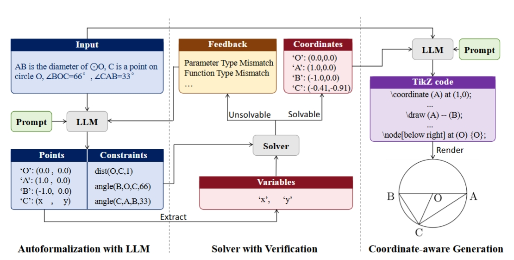
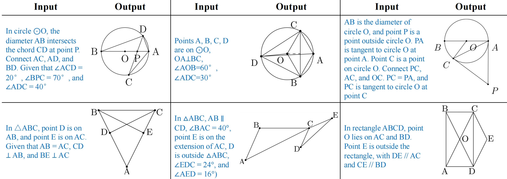
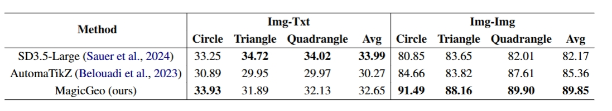
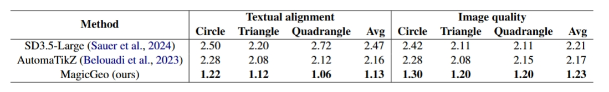

# MagiceG*e*o<br><sub><sup>Training-Free Text-Guided Geometric Diagram Generation</sup></sub>

MagicG*e*o is a training-free framework 
designed for generating geometric diagrams from textual descriptions. Creating precise diagrams directly from text can be challenging, but MagicGeo simplifies the process by formulating
diagram generation as a coordinate optimization problem, integrating large language models for text translation and a formal language solver to ensure geometric correctness. 
MagicGeo’s coordinate-aware generation effectively handles spatial relationships in text-to-diagram tasks, enabling accurate and efficient geometric diagram synthesis.
<p align="center">
  
</p>
<p align="center"><b>Figure 1.</b> Framework of MagicGeo</p>

## Performance
<p align="center">
  
</p>
<p align="center"><b>Figure 2.</b> example</p>



## Table of Contents

- [MagiceG*e*oTraining-Free Text-Guided Geometric Diagram Generation](#magicegeotraining-free-text-guided-geometric-diagram-generation)
  - [Performance](#performance)
  - [Table of Contents](#table-of-contents)
  - [Install](#install)
  - [Usage](#usage)
  - [Datasets](#datasets)
  - [Citation](#citation)
  - [Acknowledgments](#acknowledgments)
  - [Maintainers](#maintainers)
## Install

```
pip install -r requirements.txt
```

## Usage
As long as the required dependencies are installed, using MagiceG*e*o to
generate, compile, render, and save TikZ drawings is straightforward.

get your own api
```
    client = OpenAI(
        api_key="***",
        base_url="***",
    )
```
Clone this project
```bash
    git clone https://link-to-project
```
Go to project directory

```bash
    cd geo
```
Startup server
```bash
    python text_to_geometric_tingV4.py
```
## Datasets
* circle: json/circle.json
* triangle: json/triangle.json
* quadrangle: json/quadrangle.json

## Citation

If MagiceG*e*o has been beneficial for your research or applications, we
kindly request you to acknowledge its use by citing it as follows:

```bibtex
@article{wang2025magicgeo,
  title={MagicGeo: Training-Free Text-Guided Geometric Diagram Generation},
  author={Wang, Junxiao and Zhang, Ting and Yu, Heng and Wang, Jingdong and Huang, Hua},
  journal={arXiv preprint arXiv:2502.13855},
  year={2025}
}
```

## Acknowledgments
The implementation of our model is largely based on
[DeepSeek](https://github.com/deepseek-ai/DeepSeek-V3).

## Maintainers

[@wjx](https://github.com/wjx421)


